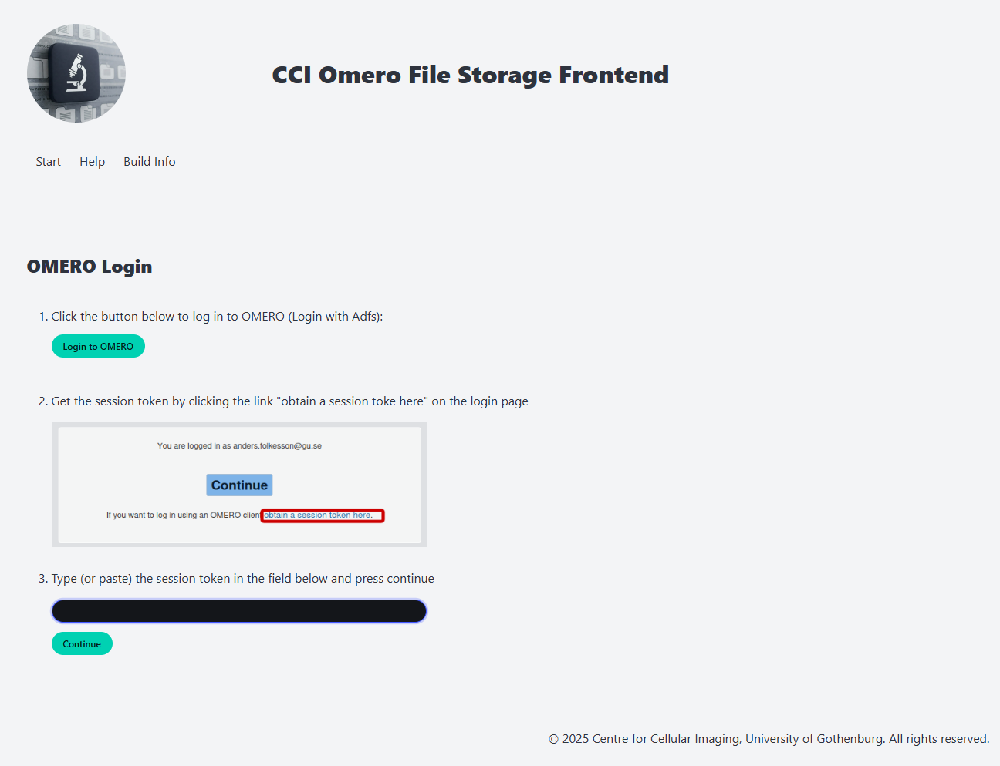
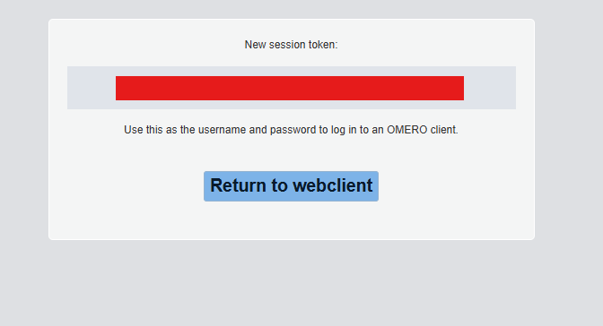
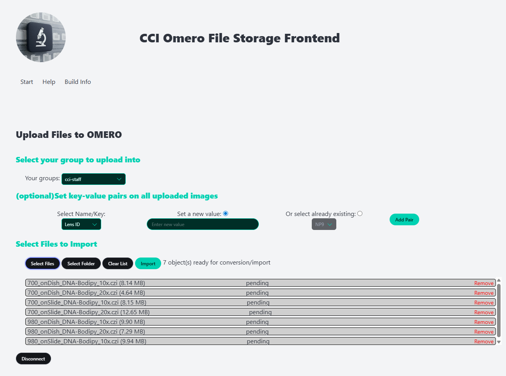
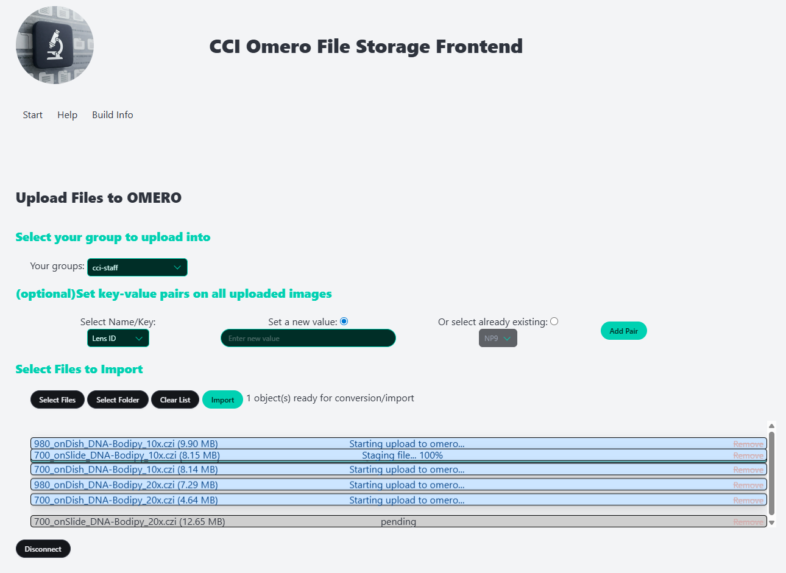

# Omero_GU

Omero application for the University of Gothenburg, Centre for Cellular Imaging (CCI).

## What is it

This service is creating a flask-app server with uwsgi subprocesses in order to easly upload images to Omero.

This services relies on having Omero setup with 2FA (OAuth). See the following [repo](https://github.com/CCI-GU-Sweden/OmeroDeployment). Be sure to activate the option in omero.web. The token can be accessible at oauth/sessiontoken.

## How does it works

From a user perspective, the interface is on purpose minimal.

A simple login, which require to input a token, created by OAuth.





Then a upload window, where an user can upload individual files or whole folder. They can also decide on which group to uplaod there data if they are part of multiple group, and have additional fields as well (Sample, PI...) that will batch apply to all upload images a tag **and** a key-value pair.



The user can then track images upload.



Images will have their metadata read, and the microscope name as well as the date of acquisition will be extracted from them. The flask app will organize the data as follow:

- project is the microscope name (default to 'undefined')
- dataset is the date of acquisition (default to the date of upload)

It will also add tags and key-value pairs in order to facilitate data search.

### More details

The app can handle file conversion (src/common/image_funcs.py). And will enforce such based on the file format:

- emi/ser file format (Electron microscope) are converted to ome.tif
- mrc/xml pairs are converted to ome.tif

Thanks to Zeiss, old czi files will have a pyramid added to there data to make them more compatible with Omero (czi_pyramidizer). This can be opt-out in the config file.

There is currently **NO** support outside the current file format supported, see in src/common/conf.py -> [".czi", ".tif", ".emi", ".ser", ".mrc", ".xml", ".emd"]

## Installation

### Local testing and debugging

You can run this from your ordinary python debugger. Setup a local python environment and ```pip install``` the requirements from ```requirements.txt```

However you choose to debug the application you will need to setup a port forward to the redis server. This can be done with oc (the openshift comman line tool) by running:
```oc port-forward svc/omero-redis 6379:6379```

for testing, it is acceptable to bypass the redis server (use to track image upload progress) by setting the ```USE_FAKE_REDIS = True``` in config.py (config.py overwrite conf.py settings and should be in the project root).

The better way to really test it is to run the docker image. Here is how, using podman:

1. install Podman
2. In the root directory of the repo run: podman build --build-arg BASE_IMAGE=docker.io/python:3.9-slim -f Dockerfile .
3. port forward according to above
4. get the image ID of te built image by, for example, running podman images
5. start the server by running the command: podman run --user root -p 5000:5000 -v ./:/app/omero IMAGE_ID (image id is something like 7fc781648bb4). The -v args maps your current directory to the /app/omero path in the image. Very convenient if you want to develop and change the code without rebuilding the image.
6. Open a browser and go to localhost:5000 to enjoy the page

## Running tests, lint and typechecking

For running the tests locally ```pip install``` the extra requirements in the file ```test_requirements.txt```

### linting (Ruff)

Make sure ruff is installed and run

ruff check --target-version=py39 src/omerofrontend/*.py

to check all files in the omerofrontend module

### typechecking (pyright)

Make sure pyright is installed and run ```pyright src/omerofrontend/*.py``` to check all files in the omerofrontend module.

### running the tests (pytest)

There are two types of tests implemented. Manual and automatic.
The manual tests need to be given a connection token for the omeroconnection to pass.

In order to run the automatic tests make sure pytest is installed and run ```pytest tests "-m not manual"```

To run the manual tests you run ```pytest tests "-m manual"```

### Deploying on Open shift

The image is built automatically on core-omero-test namespace whenever the main branch is updated in git.
When the image is in the expected and wanted state you tag it in core-omero-prod using oc:

Use oc to login and change to the core-omero-prod project

```bash
oc login --token=sha256~TOP_SECRET_HASH_FROM_OPENSHIFT --server=https://api.k8s.gu.se:6443
oc project core-omero-prod
```

Tag the image from core-omero-test with the tag you want. We advice to keep clear tag naming (e.g. v1.5)

```bash
oc tag core-omero-test/omero-frontend-test:latest omero-frontend-prod:name_of_tag
```

Update the yaml for flask-app. Look for the section:

```bash
containers:
        - name: flask-app
          image: 'image-registry.openshift-image-registry.svc:5000/core-omero-prod/omero-frontend-prod:v1.5'
```

 and update the version number in the end to the one you tagged.
