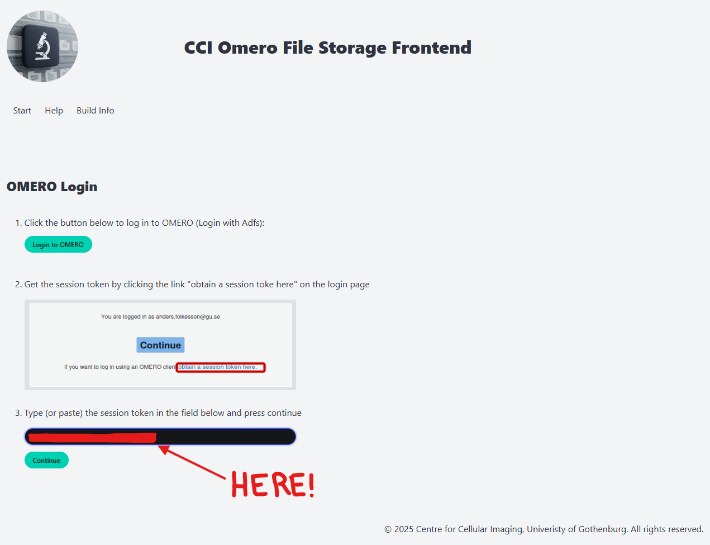
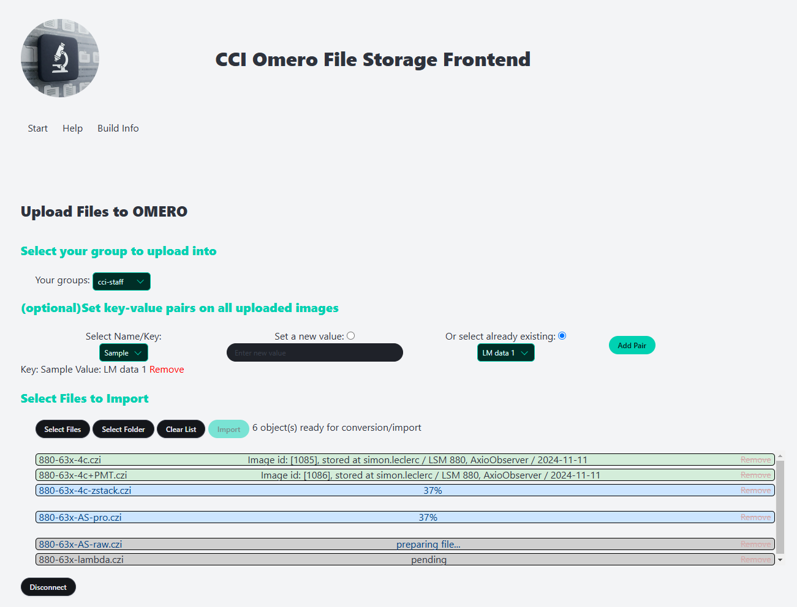

# Data management via OMERO at the CCI

___

## What is OMERO &#128300;

OMERO, short for Open Microscopy Environment Remote Objects, is a powerful software platform designed to manage, safely share, and visualize microscopy data effectively. Developed by the Open Microscopy Environment (OME) community, OMERO provides a comprehensive solution for handling the increasingly complex and large datasets generated by modern imaging technologies. 

**&#128204; Key Features of OMERO:**  
- **Centralized Data Management**: OMERO acts as a centralized hub for storing microscopy images and associated metadata, ensuring all data is organized and easily accessible.  
- **Metadata Preservation**: It preserves crucial experimental metadata during data import, which helps maintain the integrity and reproducibility of your experiments.  
- **Collaboration**: OMERO allows users to share datasets securely, control access permissions, and collaborate seamlessly across teams or institutions.  

&#128640; **Why Are We Transitioning to OMERO?**  
At the Centre for Cellular Imaging, we aim to improve the efficiency, reliability, and user experience of data management. The transition to OMERO offers several benefits over the previous NAS-based system.  
- **Enhanced Data Integrity**: By preserving metadata alongside imaging data, OMERO ensures that the full experimental context is retained, improving the reproducibility of results.  
- **Simplified Workflow**: OMERO integrates data storage and transfer into a single platform, reducing the complexity of managing large datasets.  
- **Improved Collaboration**: With OMERO’s sharing and permission control features, researchers can easily collaborate within their teams.  
- **Secure and Reliable Storage**: Data stored in OMERO is backed by robust storage infrastructure, reducing the risk of data loss or unauthorized access.  
- **Future Expansion**: While the initial rollout focuses on data transfer, OMERO’s capabilities will allow us to introduce advanced data management and analysis services in the future, supporting more sophisticated research workflows.

## Data Management Rules

The following rules govern the use of the OMERO system at the Centre for Cellular Imaging (CCI):  
- &#128194; **Allowed Data Types:**  
	- Only microscopy image data is permitted within the OMERO system. 
	- Attempts to upload unsupported file types will result in an error, and the transfer will be denied &#128683;. 
- &#9201; **Temporary Data Storage:**
	- OMERO currently supports data transfer only. Files must not remain in the system for more than **4** weeks. 
	- Users will be prompted to remove data after this period. Failure to comply may result in storage charges. 
- &#128187; **Microscope Computer Storage:** 
	- Users may temporarily store data on microscope computers to ensure safe transfer. 
	- Once the transfer is verified, users must delete the data from the microscope computers. 
	- Starting in 2025, automated systems will remove old files from the microscope computers. 
- &#128193; **Long-term Storage Requests:**
	- OMERO is not currently configured for long-term data storage. 
	- If you are interested in using OMERO for extended storage, please contact the CCI team to discuss a separate service agreement. This service falls outside the free data transfer instance. 
- &#128221; **General Data Handling Policies:**
	- During image acquisition, save your data in a folder titled with your full name within the "Users" folder on the microscope computer (quick access available on the desktop). 
	- Immediately after your imaging session, transfer the data to OMERO or your designated storage solution. *Use of USB sticks is strictly forbidden* &#128683;
	- Data transfer is allowed only in one direction: FROM CCI computers TO the user’s storage solution. 
	- Users are responsible for regularly clearing data from the system within the allowed timeframe. 
- &#128100; **User Responsibility:**
	- Once data is transferred to your storage solution, you assume full responsibility for its safekeeping, including: **(i)** Proper backup and storage **(ii)** Ensuring data integrity and ethical handling (e.g., no unauthorized image manipulation). 

By adhering to these rules, you help maintain the integrity and efficiency of the OMERO system for all users. Thank you for your cooperation. 

___
## Initial Login

The creation of your account only require your xaccount or your guaccount.  
In case you are not part of GU, please contact in advance the CCI staff so that we can setup a temporary account for you.  
Please, send us by email your xaccount or your guaccount, and we will enable you OMERO usage.  

&#128275; **Login to OMERO**

Visit the following link: [https://omero-cci-users.gu.se/](https://omero-cci-users.gu.se/).  

Click on "Login with ADFS" to proceed.  

Authenticate using your preferred method (e.g., BankID), following the instructions provided on the website.  

By default, you will belong to the new-pi group:  

Please logout, by going to the top right corner, and click on your name:  

&#9989; Let us know if it worked then we can create your group.

___

## Connecting to OMERO from the Microscope computers &#128187;

&#128273; **Log into iLab**  
Access the iLab website as you would to activate your microscopy session.  
Authenticate using either SWAMID or your iLab credentials.  
Link: [https://gothenburg.corefacilities.org/account/login](https://gothenburg.corefacilities.org/account/login)
 
&#128269; **Locate the OMERO Upload App**  
On the iLab CrossLab page, navigate to the "About Our Core" tab.  
Scroll down to the Links, Materials, and Resources section. Here, you will always find the latest link to the OMERO Upload App.  
Link: [https://omero-flask.apps.k8s.gu.se/](https://omero-flask.apps.k8s.gu.se/)  

Click "Login to OMERO" to begin the authentication process. This requires two-factor authentication as with the initial login.  

After successful authentication, do not click on "Continue." Instead, select "obtain a session token here."  

Copy the session token provided and return to the OMERO login tab.  

Click "then click here to enter your session", paste the session token into the designated field, and click Submit.  

&#9989; **Verify Successful Login**  
If your login is successful, the OMERO Upload App interface will appear as shown below.  

___
## Uploading data to OMERO from the Microscope computers &#128228;

**Log into the OMERO Upload App**  
Follow the instructions provided in the "Connecting to OMERO from the Microscope Computers" section to access the OMERO Upload App. 

&#65039; **Setup the Upload**
If you are part of different group, you can upload directly in the group the data belongs to. Select the group in the "Your groups" drop-down menu.

Optionaly, you can set a key-value pairs on **ALL** the image to upload. So far we propose only a 'Sample' key. You can either set a new value or grab an existing one, be sure to click on the "Add Pair" button. A new line will be added, and all images uploaded will have a new tag as well as a new entry in the key-pair values. You can remove it by clicking the 'Remove' text.

&#128194; **Select Files or Folders to Upload**  
You can choose to upload either individual files or an entire folder. 
- *Single File Upload*: Select individual files from your local system. 
- *Folder Upload*: Select a folder to upload all supported files within it. Unsupported file types will be ignored. It is recursive, and the folder **name** will be stored in the key-value pair.

For now, the app support the following file formats:  
- CZI file from Zeiss Light Microscope (LSM700, LSM710, LSM880, LSM980, CD7, Observer, Imager and ELYRA7).  
- EMD file from Electron Microscopy. This file will be converted to OME-TIFF.  
- EMI/SER files Electron Microscopy. Both need to be present in the file list to upload. This file will be converted to OME-TIFF.  
- MRC/XML files from ATLAS Electron Microscopy. Both need to be present in the file list to upload. This file will be converted to OME-TIFF.  
- SEM-TIF file from Smart-SEM Electron Microscopy. This file will be converted to OME-TIFF.  

&#9654; **Start the Upload Process**
Click the "Import" button to begin uploading files to the OMERO instance.  
Files will be uploaded one at a time in the order they appear in the queue.  

The image row color has a meaning:  
- gray, pending upload
- yellow, in queue
- cyan, uploading
- green, uploaded
- orange, image already exist
- red, an error occur. Check the error message.

&#9989; **Verify Uploaded Files**  
Switch to the OMERO.web tab.  
Locate and verify your uploaded files. It may be needed to refresh Omero.

&#128193; **File Organization in OMERO**
Uploaded files are automatically organized according to:  
- *OMERO Project*: Named after the microscope used to generate the data.  
- *OMERO Dataset*: Created with the date on which the microscopy image was generated, formatted as YYYY-MM-DD.  
- *Images*: All image files generated on the same day and from the same microscope are grouped within the corresponding dataset.  

___
## Downloading data from OMERO to your own storage solution &#128229;

From any computer connected to the net, access [https://omero-cci-users.gu.se/](https://omero-cci-users.gu.se/).  
You will be required to login using your GU credentials and 2-factors. Access to the web-service by clicking on "Continue".  
You can browse and explore the data directly from Omero-web. The tag tab allows to display all images possessing the selected tag(s).

To download the data, select one or multiple images, then click on the download icon. Multiple options are offered to you:
- *Download...*: will download the original data that has been uploaded. Not always possible for Electron Microscopy
- *Original Metadata*: will download the original metadata of the image as a text file (individual file only)
- *EXPORT as OME-TIFF*: will export the image as a OME-TIFF, a TIFF with a XML header that contains all relevant metadata (individual file only) in a zip file that will be attached to the image.
- *EXPORT as PNG, JPEG, TIFF*: will export the image as png, jpg or tiff image respectively. Not metadata will be saved in these files (**NO** pixel size!)

Alternativly, there is an export script (click on &#65039; in Omero, 'export_script' then 'Batch Image Export...') which allow you to export the selected images in OME-TIFF, PNG, JPEG or TIFF.

Check that the data has been correctly transfered.  

&#9888; Files must not remain in the system for more than **4** weeks.
